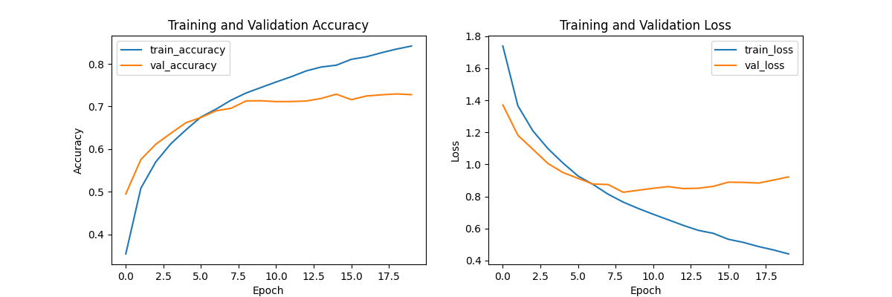

# Image Classification Project

This project demonstrates image classification using a Convolutional Neural Network (CNN) on the CIFAR-10 dataset. It is built with Keras and TensorFlow.

## Project Structure

```plaintext
/image_classification_project/
├── data_preparation.py      # Code for loading and preparing data
├── model.py                 # Code defining the CNN model
├── train_model.py           # Code for training the model
├── evaluate_model.py        # Code for evaluating the model
├── visualize_results.py     # Code for visualizing results

### Prerequisites

- Python 3.10
- TensorFlow
- Keras


## Training History

Here is the training history graph showing the model's accuracy and loss over the epochs:



## Usage<br>

## Setup and Installation

1. Clone the repository:<br>
   git clone https://github.com/Rohnnam/image-classification-project.git <br>
   cd your-repository/image_classification_project<br>

2. python -m venv .venv<br>
   source .venv/bin/activate  # On Windows, use `.venv\Scripts\activate`  <br>  

3. pip install -r requirements.txt

## Training the Model

1. Run the training script:
   python image_classification_project/train_model.py

2. Evaluate the trained model:
   python image_classification_project/evaluate_model.py

3. Generate and save visualizations:
   python image_classification_project/visualize_results.py
